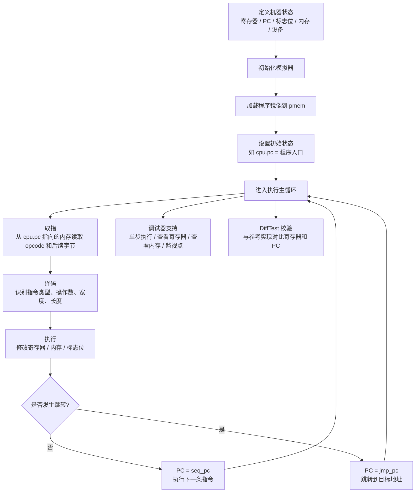
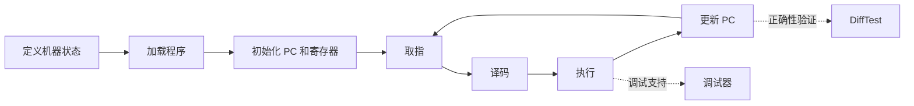
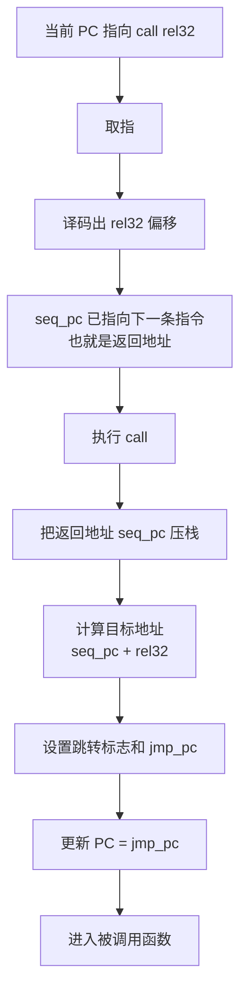

**user**: 你好
[Context: Notes: README.md]
[Timestamp: 2026/04/24 01:47:34]

**ai**: 你好呀！很高兴见到你。有什么想聊或想让我帮你整理成笔记的吗？
[Timestamp: 2026/04/24 01:47:49]

**user**: 你是什么模型
[Context: Notes: README.md]
[Timestamp: 2026/04/24 01:47:54]

**ai**: 我是 Obsidian Copilot，一个集成在 Obsidian 里的 AI 助手，可以帮你回答问题、整理内容、润色文本、生成或改写笔记、总结资料、解释代码等。

如果你想知道我的能力边界或想测试一下，也可以直接给我一个任务。
[Timestamp: 2026/04/24 01:48:01]

**user**: [[模拟器是如何实现的]] 帮我总结一下这个文档
[Context: Notes: 模拟器是如何实现的.md, README.md]
[Timestamp: 2026/04/24 01:48:15]

**ai**: 可以把 [[模拟器是如何实现的]] 总结成这几部分：

## 一句话核心

模拟器本质上是在软件里维护一份“机器状态”，然后不断执行：

- 取指
- 译码
- 执行
- 更新 PC

也就是把真实硬件的状态机行为，用程序模拟出来。

## 文档主线

### 1. 先定义机器状态

模拟器首先要在软件中表示一台“假的计算机”，通常包括：

- 通用寄存器
- 程序计数器 `PC`
- 标志寄存器
- 内存 `pmem`
- 设备状态

这些状态共同构成“被模拟的硬件”。

### 2. 加载程序到模拟内存

启动时需要先初始化环境，然后把程序镜像读入内存，并设置初始 `PC`。

主要过程是：

- 初始化内存
- 加载二进制镜像
- 初始化 ISA 相关状态
- 设置程序入口地址

这样程序就已经放进模拟器里，等待执行。

### 3. 进入执行循环

模拟器运行的核心是一个循环，不断执行单条指令：

- 从 `cpu.pc` 指向的位置取指
- 根据 opcode 译码
- 按指令语义修改寄存器/内存/标志位
- 根据是否跳转更新 `PC`

这一步是模拟器最核心的执行引擎。

### 4. 一条指令的执行过程

文档把一条指令拆成四步：

- 取指：从内存取出 opcode 和后续字节
- 译码：识别是什么指令、操作数在哪、宽度是多少
- 执行：按照 ISA 语义修改状态
- 更新 PC：顺序执行或跳转到目标地址

其中对于 x86 这种变长指令集，译码通常和取指交织在一起。

### 5. 用 `call rel32` 举例说明

文档用 `call` 指令说明完整闭环：

- 先译码得到相对偏移 `rel32`
- 此时 `seq_pc` 已经指向下一条指令，也就是返回地址
- 执行时：
  - 把返回地址压栈
  - 计算跳转目标并设置跳转标志
- 最后更新 `PC` 到被调用函数入口

这个例子说明，所谓“实现一条指令”，本质就是把 ISA 手册里的语义翻译成对状态的读写。

### 6. 调试器也是模拟器的重要组成部分

除了执行器，模拟器还需要调试器来辅助开发和验证，比如：

- 单步执行
- 查看寄存器
- 查看内存
- 表达式求值
- 监视点

所以模拟器不只是“能跑程序”，还要“能观察和调试程序”。

### 7. 如何验证模拟器是否正确

文档提到 difftest 思路：

- 模拟器执行一条指令
- 参考实现也执行一条
- 对比寄存器和 `PC`

如果状态不一致，就说明实现有问题。这个机制对保证模拟器正确性非常关键。

## 最后结论

这篇文档的核心观点是：

- 模拟器不是“真的运行硬件”
- 而是“维护硬件状态 + 按 ISA 规则更新状态”

因此，实现模拟器的关键就是：

- 建模状态
- 加载程序
- 实现指令执行循环
- 正确处理每条指令的语义
- 借助调试器和 difftest 验证正确性

如果你愿意，我还可以继续帮你把这个总结压缩成：

- 适合面试回答的 1 分钟版本
- 适合放到笔记开头的超短摘要版
- 适合画图理解的流程图版
[Timestamp: 2026/04/24 01:48:59]

**user**: 帮我生成一个上述流程的图片
[Context: Notes: README.md]
[Timestamp: 2026/04/24 01:49:23]

**ai**: 可以，我给你生成一个适合直接放进 Obsidian 的流程图。你把下面这段 `mermaid` 代码粘到笔记里，就可以渲染成图片式流程图。

## 模拟器实现流程图



## 更适合笔记展示的简洁版

如果你想要一个更像“总览图”的版本，可以用这个：



## 如果你想要“call 指令示例图”

这个版本专门展示 `call rel32` 的执行过程：



## 建议

如果你是想放到 [[模拟器是如何实现的]] 这篇笔记里，我建议用第一个版本，因为它最完整。

如果你愿意，我还可以继续帮你生成：

- 一个黑白简洁风的版本
- 一个更像课件的竖向流程图
- 一个“取指-译码-执行-更新PC”的彩色分层图
- 直接帮你整理成可粘贴进 [[模拟器是如何实现的]] 的完整笔记段落
[Timestamp: 2026/04/24 01:50:07]

**user**: 我想使用 gpt-5.4 的Embedding Models，怎么办
[Context: Notes: README.md]
[Timestamp: 2026/04/24 01:52:20]

**ai**: 如果你想用“gpt-5.4 的 Embedding Models”，先要区分一件事：

- `GPT-5.4` 这类通常是对话/生成模型
- `Embedding model` 是专门用来把文本转成向量的模型
- 它们通常不是同一个模型，也不会按同样的命名方式提供

所以一般做法不是“找 GPT-5.4 的 embedding 版本”，而是：

- 聊天/生成任务用 `gpt-*`
- 向量化/检索任务用专门的 `text-embedding-*`

## 你应该怎么做

### 1. 先确认你的平台支持哪些 embedding 模型

很多平台上，Embedding 并不会叫 `gpt-5.4-embedding`，而是类似：

- `text-embedding-3-large`
- `text-embedding-3-small`

如果你是在某个 API 平台、代理平台、云厂商或者第三方中转服务上使用，先去它的模型列表里看：

- 是否支持 embeddings 接口
- 具体模型名是什么
- 输入 token 限制是多少
- 向量维度是多少
- 价格如何

## 2. 如果你只是想做知识库 / RAG / 语义搜索

通常直接选：

- `text-embedding-3-small`
  - 更便宜
  - 速度快
  - 适合大多数检索场景
- `text-embedding-3-large`
  - 效果更强
  - 向量更大
  - 适合对召回质量要求更高的场景

简单建议：

| 需求 | 推荐 |
| --- | --- |
| 低成本、快速上线 | `text-embedding-3-small` |
| 更高检索质量 | `text-embedding-3-large` |

## 3. 基本调用方式

如果你用的是 Python，通常是这种思路：

```python
from openai import OpenAI

client = OpenAI()

response = client.embeddings.create(
    model="text-embedding-3-small",
    input="模拟器的本质是用软件维护硬件状态机"
)

embedding = response.data[0].embedding
print(len(embedding))
```

如果你想换成更强的模型：

```python
response = client.embeddings.create(
    model="text-embedding-3-large",
    input="模拟器的本质是用软件维护硬件状态机"
)
```

## 4. 在 RAG 里的标准流程

如果你的目标是给笔记、文档、Obsidian 知识库做语义检索，一般流程是：

- 把文档切分成 chunk
- 用 embedding 模型把每个 chunk 转成向量
- 存到向量数据库
- 用户提问时，把问题也转成向量
- 做相似度搜索
- 把检索结果喂给 `gpt-5.4` 这类生成模型回答

也就是说：

- `Embedding model` 负责“找资料”
- `GPT-5.4` 负责“组织答案”

## 5. 如果你坚持想要“和 GPT-5.4 配套”

那正确理解通常是：

- 用 `GPT-5.4` 做回答
- 用当前平台推荐的 embedding 模型做向量检索

而不是要求“必须存在一个叫 GPT-5.4 Embedding 的模型”。

## 6. 一个完整示例思路

比如你要做“Obsidian 笔记问答”：

- 笔记内容切块
- 每个块调用 `text-embedding-3-small`
- 存入 FAISS / Chroma / Milvus / pgvector
- 用户提问
- 问题也转向量
- 检索最相关的几个笔记片段
- 把这些片段连同问题一起发给 `gpt-5.4`
- 输出答案

## 7. 你现在最该确认的事

你可以先告诉我这几个信息，我可以直接给你对应代码：

- 你用的是哪个平台的 API
- 你想用 Python、JavaScript 还是别的语言
- 你的目标是：
  - 语义搜索
  - RAG 问答
  - 文本聚类
  - 推荐系统
- 你准备用哪个向量库：
  - FAISS
  - Chroma
  - pgvector
  - Milvus
  - Pinecone

如果你愿意，我下一条可以直接给你一份：

- Python 版 embedding 调用示例
- 或者“Obsidian/RAG 知识库”完整最小可运行项目模板
[Timestamp: 2026/04/24 01:53:19]

**user**: 你觉得我这个 obsidian 仓库使用embedding large 还是 embedding small
[Context: Notes: copilot/copilot-conversations/中文问候@20260424_014734.md]
[Timestamp: 2026/04/24 01:56:43]

**ai**: 我建议你这个 Obsidian 仓库，先用 `text-embedding-3-small`，除非你已经明确遇到检索质量不够的问题，再升级到 `text-embedding-3-large`。

## 为什么我更推荐先用 small

从你现在这个仓库的使用方式来看，更像是：

- 个人知识库
- 笔记问答
- 文档总结
- 代码/技术类内容检索

这类场景通常有几个特点：

- 数据量不一定特别夸张
- 查询频率可能比企业级知识库低
- 更关注“够用、便宜、响应快”
- 先把 RAG 流程跑通比一开始追求最强召回更重要

所以 `small` 往往是性价比最高的起点。

## 什么时候选 small

如果你满足下面大多数情况，直接选 `small`：

- 你的仓库是个人笔记库
- 笔记数量还没有大到非常夸张
- 主要是中文技术笔记、学习笔记、项目记录
- 你想先低成本验证效果
- 你还在搭建索引、切块、检索、重排这些基础流程

你的当前情况，我感觉比较符合这一类。

## 什么时候考虑 large

如果你后面出现这些问题，再考虑切到 `large`：

- 检索经常召回不到真正相关的笔记片段
- 很多内容语义很接近，容易混淆
- 你有大量长文档、课程笔记、论文笔记、代码分析笔记
- 你对“召回质量”比“成本和速度”更敏感
- 你已经把 chunk 切分、top-k、rerank 都调过了，效果还是不满意

也就是说，`large` 更适合“已经证明 small 不够用”的阶段。

## 一个很实用的选择策略

我建议你按这个顺序来：

- 第一步：全库先用 `text-embedding-3-small`
- 第二步：实际测试 20 到 50 个真实问题
- 第三步：观察结果是否存在明显问题
  - 找不到相关笔记
  - 找到的片段不准
  - 相近主题混在一起
- 第四步：如果问题明显，再切 `text-embedding-3-large` 做 A/B 对比

这比一开始直接上 `large` 更稳。

## 对你这个仓库的直接建议

如果你问我一句话结论：

- 现在先用 `text-embedding-3-small`
- 等你把知识库问答跑起来后，再决定要不要升级到 `text-embedding-3-large`

## 补一个判断表

| 场景 | 推荐 |
| --- | --- |
| 个人 Obsidian 笔记库起步阶段 | `text-embedding-3-small` |
| 预算敏感，先求可用 | `text-embedding-3-small` |
| 检索质量已经成为瓶颈 | `text-embedding-3-large` |
| 大规模、高质量语义检索 | `text-embedding-3-large` |

## 我额外建议你关注的，其实不只是模型大小

很多时候检索效果差，不一定是 embedding 模型的问题，更可能是：

- chunk 切分不合理
- chunk 太大或太小
- 没保留笔记标题和层级结构
- 没把标签、标题、路径一起参与索引
- 检索后没有 rerank
- 提示词没有要求“优先依据检索结果回答”

对 Obsidian 仓库来说，下面这种切法通常很重要：

- 保留笔记标题
- 保留二级/三级标题
- 每个 chunk 带上来源路径
- 把 tags 也拼进 chunk 元数据

这往往比单纯从 `small` 换到 `large` 更影响最终效果。

如果你愿意，我可以下一步直接帮你做两件事之一：

- 给你一个“Obsidian 知识库 embedding 选型方案”
- 直接给你一份适合你仓库的 chunking + embedding + 检索配置建议
[Timestamp: 2026/04/24 01:57:35]

**user**: 我这个文件夹主要是做什么
[Timestamp: 2026/04/24 02:48:37]

**ai**: <errorChunk>Connection error.
more message: Failed to fetch</errorChunk>
[Timestamp: 2026/04/24 02:53:05]